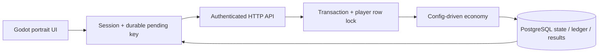

# Architecture / ADR 001

## Stack decision

| Criterion | Flutter + Flame | Godot 4.6.3 |
|---|---|---|
| UI and accessibility | Strong native-style widgets | Control/theme system; accessibility needs explicit review |
| 2D scenes and animation | Flame plus Flutter integration | Scene tree, tweens, particles, integrated editor |
| Android | Mature builds, Dart/Android SDK | Native APK export; compatibility renderer for modest devices |
| Small-team workflow | Excellent for UI-heavy apps | Strong for map interactions, reels and future attack scenes |
| Maintenance | Separate Flutter/Flame versions | One pinned engine version; GDScript is statically typed where useful |

Choose **Godot 4.6.3**, not merely because installed: the roadmap includes interactive maps, reels, raids and visual effects, which benefit from its native scene workflow. Portrait Control UI remains separate from rendering and network. No 3D or custom native plugins. No third-party Godot libraries in milestone 1. FastAPI + SQLAlchemy + psycopg + PostgreSQL 17 is a small monolith with explicit migrations. Supabase remains a possible managed PostgreSQL/auth provider; integrating its auth requires token verification and guest linking, not trusting arbitrary player IDs.

## Boundaries

- `client/scripts/main.gd`: navigation and presentation only; never calculates payouts.
- `game_session.gd`: authentication, cached presentation state, command queue, reconnect, tutorial.
- `api_client.gd`: HTTP transport and bearer authentication; timeouts are ambiguous, not failures of game logic.
- `local_store.gd`: atomic pending-command/session persistence in application sandbox.
- `game_ui.gd`, `slot_reel.gd`, `symbol_icon.gd`, `world_view.gd`: reusable UI and original vector placeholders.
- `backend/app/main.py`: strict request contracts and authorization.
- `service.py`: transactions and unified RewardService/ledger; player-row lock for **all** economy operations.
- `economy.py`: pure, injected-time/randomness calculations.
- PostgreSQL: authoritative progression, wallet, energy, sessions, building levels, operation results, ledger and history.

## Command lifecycle

Persist UUID request key **before** sending. Authenticate without accepting a client player ID. Lock player row, reject banned accounts, compare saved operation fingerprint, load active economy revision, regenerate from DB clock, validate/debit/apply, save result and ledger atomically. A retry gets the original operation response. Client then fetches latest state to avoid replacing newer balances with an old replay snapshot. A 4xx is a definitive rejection; network errors/5xx retain the pending key. Other commands remain disabled until ambiguity is resolved.

## Future interfaces (planned, not implemented)

- `AuthProvider`: guest now; Google identity token verification and link/merge policy later.
- `AnalyticsService`: provider-independent event bus, privacy/consent, server economy events + client presentation events.
- `AssetManager`/`AudioService`: symbolic IDs resolved through manifests; assets and sound rights reviewed before release.
- `AdService`/`BillingService`: mock only when explicitly labelled; production grants require verified server callbacks/Google purchase tokens.
- `EventEngine`: versioned rules and milestones, see EVENT_SYSTEM.md.

## Release prerequisites

Current slice is local development, **NOT PRODUCTION READY**. Missing HTTPS deployment, rate limits/guest-abuse protection, account linking/recovery/token renewal/revocation, secure keystore token storage, production signing, telemetry/privacy policy, config schema validation/controlled publishing, backups/restore exercise and load testing. No developer balance endpoints exist. Debug endpoint override is excluded by `OS.is_debug_build()`; release requires configured HTTPS. No production APK is claimed.
